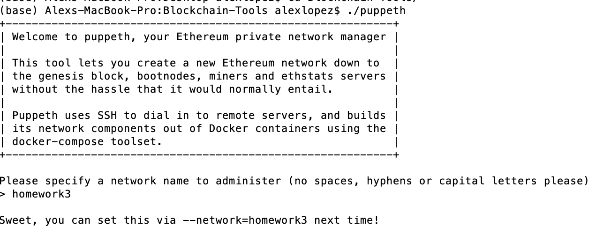
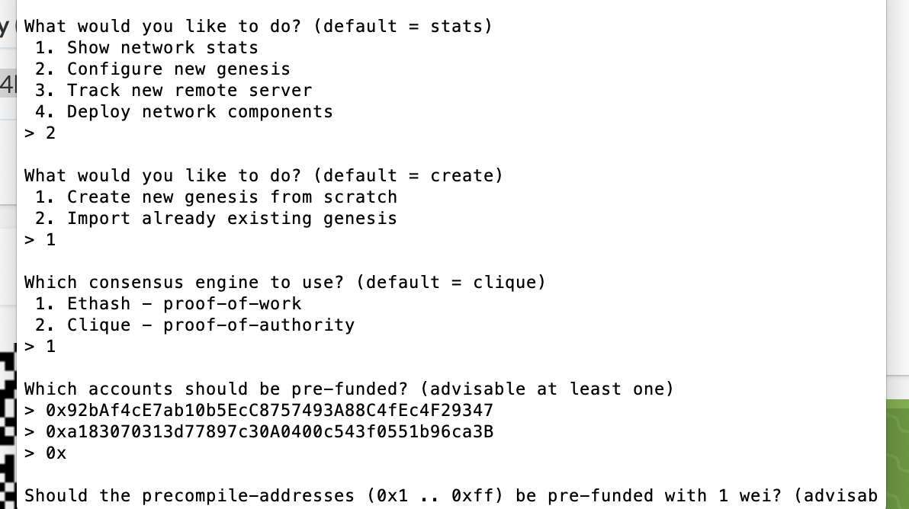
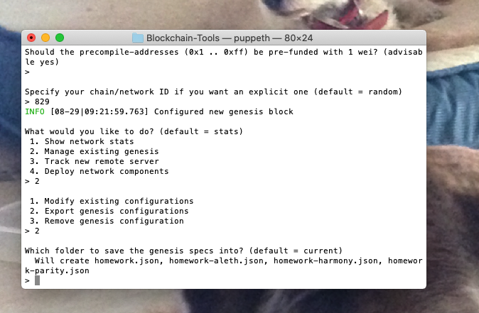
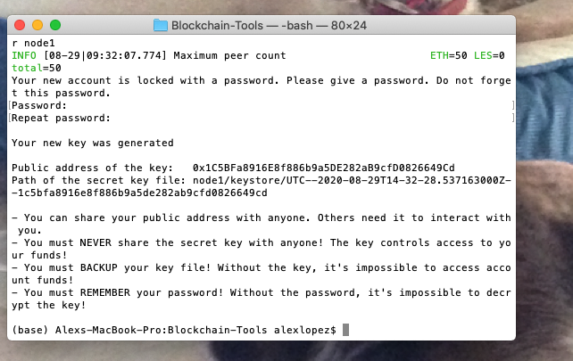
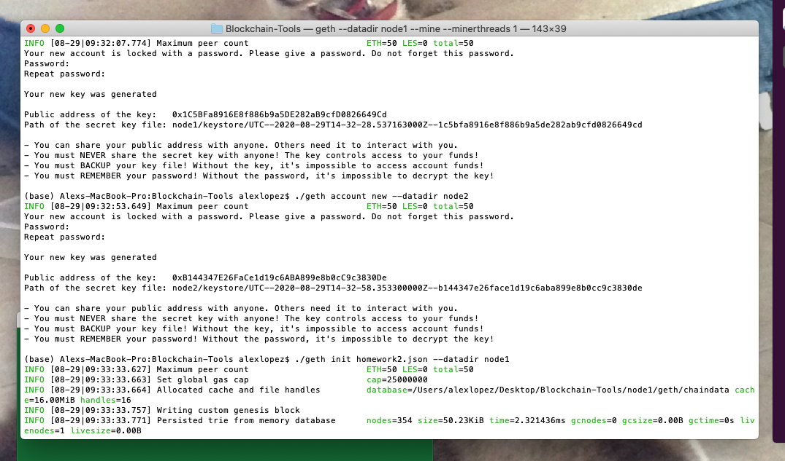
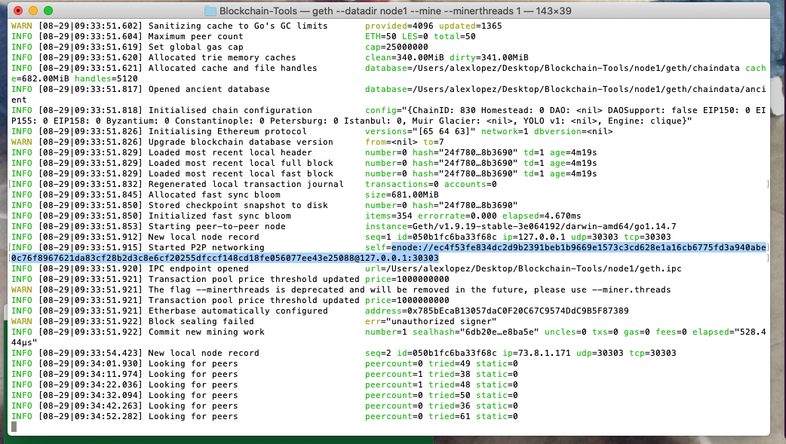
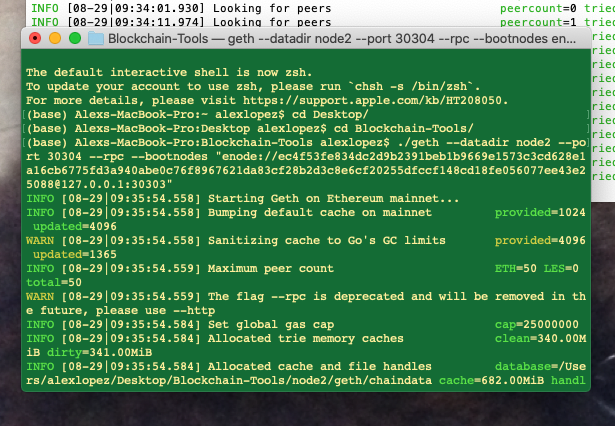
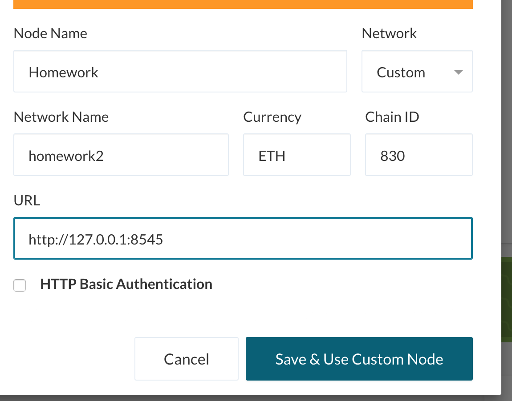

# Hw-18- Blockchain

Below is the step by step setup and creation of a wroking ETH blockchain via the command line: 

Step 1: 
- once you are in the directory with your blockchain tools:
- enter the command: ./puppeth
- The follow screen will appear:
- Enter a network name(can be anything)

- Step 2: Prefund accounts 

Step 3: Configure the new gensis block: 

Step 4: Create the Nodes 

- To create Node 1: 
    - the following command:
    - ./geth account new --datadir node1
    - it will ask for the password, you willl need to type it twice 
    - it will also give you a Public and private key, create a cheat sheet to store these for later

- Repeat the above steps for node two after using the following command: ./geth account new --datadir node2 

- You are now ready to intiate your accounts: 
    - run the following commands to do so: 
    - ./geth init puppernet.json --datadir node1
    - ./geth init puppernet.json --datadir node2

- You are now ready to start mining, run the following command: 
    - ./geth --datadir node1 --mine --minerthreads 1
    - once you run the command you will need to find the enode(highlighted above), copy that to cheatsheet 

-Next you will need  open a second terminal and navigate back into your Blockchain tools folder 
    - once there run the following command: 
        - ./geth --datadir node2 --port 30304 --rpc --bootnodes " enode://the one you just copied"

- The Blockchain is now up and running  

-Finally you need to create a new node network in MyCrypto to make transfers 

- Inside Mycrypto use the in the bottom left corner:
- first click 'Change Network', then 'Add Custom Node', type in information above 

- Once the network is up and running, you now send money back and forth. 

